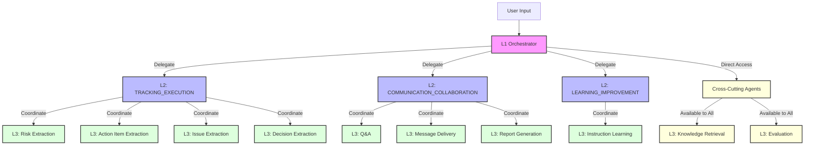

# Nion Orchestration Engine

A sophisticated three-tier AI orchestration system that processes messages through L1 → L2 → L3 architecture to track action items, risks, issues, and decisions across projects. Features **Google Gemini AI integration** for intelligent reasoning and natural language responses.

## 🎯 Architecture

### Three-Tier System

- **L1 Orchestrator**: AI-powered intent analysis, reasoning, and execution planning using Google Gemini
- **L2 Coordinators**: Domain-specific task coordination
  - TRACKING_EXECUTION - Extraction and tracking of items
  - COMMUNICATION_COLLABORATION - Q&A, reporting, delivery
  - LEARNING_IMPROVEMENT - Learning from instructions
- **L3 Agents**: Specialized task executors (14+ agents for extraction, tracking, Q&A, delivery, etc.)

### Visibility Rules (Enforced)

- **L1** can see: L2 domains + Cross-Cutting agents only
- **L2** can see: Its own L3 agents + Cross-Cutting agents
- **Cross-Cutting Agents** (accessible by all layers): knowledge_retrieval, evaluation

## 🚀 Quick Start

### Prerequisites

- **Python 3.9 or higher** (required for pydantic and type hints)
- pip (Python package manager)
- Google Gemini API key (get free at https://makersuite.google.com/app/apikey)

### Installation

1. **Install dependencies:**
```bash
pip install -r requirements.txt
```

2. **Set up Google Gemini API key:**

Get your FREE API key:
- Visit: https://makersuite.google.com/app/apikey
- Sign in with Google
- Click "Create API Key"
- Copy the key

Configure it (choose one method):
```bash
# Method 1: Create .env file (recommended)
echo "GOOGLE_API_KEY=your_actual_api_key_here" > .env

# Method 2: Environment variable (temporary)
export GOOGLE_API_KEY='your_actual_api_key_here'
```

3. **Test the system:**
```bash
# Run a test case
python3 main.py test_cases/test_case_1.json

# You should see:
# ✅ Gemini AI initialized successfully!
# [L1 Reasoning] Intent: status_query | Urgency: medium
```

**Note:** The system works without an API key using rule-based reasoning, but AI-enhanced features require the Gemini API key.

## 📋 Usage

### Run Individual Test Cases

```bash
# Test 1: Simple status question
python3 main.py test_cases/test_case_1.json

# Test 2: Feasibility question (new features)
python3 main.py test_cases/test_case_2.json

# Test 3: Decision/recommendation request
python3 main.py test_cases/test_case_3.json

# Test 4: Meeting transcript
python3 main.py test_cases/test_case_4.json

# Test 5: Urgent escalation
python3 main.py test_cases/test_case_5.json

# Test 6: Ambiguous request
python3 main.py test_cases/test_case_6.json
```

### Run Your Own Test Case

Create a JSON file with this format:
```json
{
  "message_id": "MSG-999",
  "source": "email",
  "sender": {
    "name": "Your Name",
    "role": "Your Role"
  },
  "content": "Your message content here",
  "project": "YOUR-PROJECT"
}
```

Then run:
```bash
python3 main.py your_test.json
```

### Input Format

Input messages should be JSON files with the following structure:

```json
{
  "message_id": "MSG-001",
  "source": "email",
  "sender": {
    "name": "Sarah Chen",
    "role": "Product Manager"
  },
  "content": "Your message content here",
  "project": "PRJ-ALPHA"
}
```

## 🎯 How It Works

1. **L1 Orchestrator** analyzes the message using Google Gemini AI (or rule-based fallback)
2. **L1** identifies intent (status_query, feasibility_query, decision_request, escalation, meeting_update, general_request)
3. **L1** creates an execution plan with tasks and dependencies
4. **L1** delegates to **L2 domains** and **Cross-Cutting agents** (respecting visibility rules)
5. **L2 Coordinators** break down tasks and coordinate their **L3 agents**
6. **L3 Agents** execute specific tasks (extraction, tracking, Q&A, delivery)
7. Results flow back up through the hierarchy
8. **Output Formatter** generates the orchestration map

### Architecture Diagram



## 📁 Project Structure

```
Assessment/
├── main.py                          # Entry point
├── requirements.txt                 # Python dependencies
├── README.md                        # This file
├── .env.example                     # Environment variables template
├── .gitignore                       # Git ignore rules
├── src/
│   ├── models.py                    # Data models (InputMessage, Task, etc.)
│   ├── agents.py                    # Agent registry and visibility rules
│   ├── l1_orchestrator.py           # L1 reasoning and planning logic
│   ├── l2_coordinators.py           # L2 coordinator implementations
│   ├── l3_agents.py                 # L3 agent implementations
│   ├── orchestration_engine.py      # Main orchestration coordinator
│   └── output_formatter.py          # Output formatting
├── test_cases/
│   ├── test_case_1.json
│   ├── test_case_2.json
│   ├── test_case_3.json
│   ├── test_case_4.json
│   ├── test_case_5.json
│   └── test_case_6.json
└── outputs/
    ├── output_1.txt
    ├── output_2.txt
    ├── output_3.txt
    ├── output_4.txt
    ├── output_5.txt
    └── output_6.txt
```

## Output Format

The engine produces a formatted orchestration map showing:

1. **Message Details**: ID, sender, project
2. **L1 Plan**: All planned tasks with dependencies
3. **L2/L3 Execution**: Detailed execution results with outputs

Example output structure:

```
======================================================================
NION ORCHESTRATION MAP
======================================================================
Message: MSG-001
From: Sarah Chen (Product Manager)
Project: PRJ-ALPHA

======================================================================
L1 PLAN
======================================================================
[TASK-001] → L2:TRACKING_EXECUTION
Purpose: Extract action items from request

[TASK-002] → L3:knowledge_retrieval (Cross-Cutting)
Purpose: Retrieve project context
Depends On: TASK-001

======================================================================
L2/L3 EXECUTION
======================================================================

[TASK-001] L2:TRACKING_EXECUTION
└─▶ [TASK-001-A] L3:action_item_extraction
    Status: COMPLETED
    Output:
    • AI-001: "Extracted action item details"
    
[TASK-002] L3:knowledge_retrieval (Cross-Cutting)
Status: COMPLETED
Output:
• Project: PRJ-ALPHA
• Current Release Date: Dec 15

======================================================================
```

## ✨ Key Features

### AI-Enhanced (with Gemini API)
- 🧠 **Intelligent intent recognition** - AI analyzes sender role, content, and context
- 💬 **Natural language responses** - Human-like, conversational answers
- 🎯 **Context-aware reasoning** - Understands urgency and nuance
- 📊 **Smart gap detection** - Identifies what information is missing

### Core Capabilities
- ✅ Three-tier orchestration (L1 → L2 → L3)
- ✅ Visibility rules enforcement (L1 can't see L3 directly)
- ✅ Dependency management between tasks
- ✅ Gap-aware responses (acknowledges what's known/unknown)
- ✅ 14+ specialized agents
- ✅ Cross-cutting agents accessible to all layers
- ✅ Structured output formatting
- ✅ **Rule-based fallback** (works without API key)

## 🐛 Troubleshooting

### API Key Issues

**Check if API key is set:**
```bash
echo $GOOGLE_API_KEY
# Or check .env file:
cat .env
```

**Common Issues:**

1. **"GOOGLE_API_KEY not found"**
   - Create `.env` file with: `GOOGLE_API_KEY=your_key_here`
   - Or export it: `export GOOGLE_API_KEY='your_key_here'`

2. **"404 models/... is not found"**
   - Already fixed! Using `models/gemini-2.0-flash`
   - System will fall back to rule-based reasoning

3. **Import errors**
   - Run: `pip install -r requirements.txt`
   - Make sure you're in the Assessment directory

4. **System uses rule-based reasoning even with API key**
   - Check API key validity at https://makersuite.google.com/app/apikey
   - Verify key is correctly set in .env or environment

### How to Tell if API is Working

**With API (successful):**
```
✅ Gemini AI initialized successfully!
[L1 Reasoning] Intent: status_query | Urgency: medium
[L1 Reasoning] The Engineering Manager is asking...
```

**Without API (fallback):**
```
Warning: GOOGLE_API_KEY not found...
[L1 Reasoning] Rule-based analysis (API not configured)
```

## License

This project is created for the Nion Orchestration Internship Assessment.

## Author

Created as part of the Nion internship assessment.
