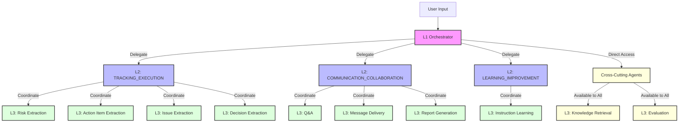

# Nion Orchestration Engine

A sophisticated three-tier AI orchestration system that processes messages through L1 → L2 → L3 architecture to track action items, risks, issues, and decisions across projects. Features **Google Gemini AI integration** for intelligent reasoning and natural language responses.

**🔗 GitHub Repository:** https://github.com/KoushikMithul/aiNion-Assessment

## 🎯 Architecture

### Three-Tier System

- **L1 Orchestrator**: AI-powered intent analysis, reasoning, and execution planning using Google Gemini
- **L2 Coordinators**: Domain-specific task coordination
  - TRACKING_EXECUTION - Extraction and tracking of items
  - COMMUNICATION_COLLABORATION - Q&A, reporting, delivery
  - LEARNING_IMPROVEMENT - Learning from instructions
- **L3 Agents**: Specialized task executors (14+ agents for extraction, tracking, Q&A, delivery, etc.)

### Visibility Rules (Enforced)

- **L1** can see: L2 domains + Cross-Cutting agents only
- **L2** can see: Its own L3 agents + Cross-Cutting agents
- **Cross-Cutting Agents** (accessible by all layers): knowledge_retrieval, evaluation

## 🚀 Quick Start

### Prerequisites

- **Python 3.9 or higher** (required for pydantic and type hints)
- pip (Python package manager)
- Google Gemini API key

### Installation

1. **Install dependencies:**
```bash
pip install -r requirements.txt
```

2. **Set up Google Gemini API key:**

Get your FREE API key:
- Visit: https://makersuite.google.com/app/apikey
- Sign in with Google
- Click "Create API Key"
- Copy the key

Configure it (choose one method):
```bash
# Method 1: Create .env file (recommended)
echo "GOOGLE_API_KEY=your_actual_api_key_here" > .env

# Method 2: Environment variable (temporary)
export GOOGLE_API_KEY='your_actual_api_key_here'
```

3. **Test the system:**
```bash
# Run a test case
python3 main.py test_cases/test_case_1.json

# You should see:
# ✅ Gemini AI initialized successfully!
# [L1 Reasoning] Intent: status_query | Urgency: medium
```

**Note:** The system works without an API key using rule-based reasoning, but AI-enhanced features require the Gemini API key.

## 📋 Usage

### Run Test Cases

```bash
# Run a single test case (with full path)
python3 main.py test_cases/test_case_1.json

# Run a single test case (by name only)
python3 main.py test_case_1

# Run multiple specific test cases
python3 main.py test_case_1 test_case_3 test_case_6

# Run ALL test cases automatically
python3 main.py --all
```

### Individual Test Cases

```bash
# Test 1: Simple status question
python3 main.py test_case_1

# Test 2: Feasibility question (new features)
python3 main.py test_case_2

# Test 3: Decision/recommendation request
python3 main.py test_case_3

# Test 4: Meeting transcript
python3 main.py test_case_4

# Test 5: Urgent escalation
python3 main.py test_case_5

# Test 6: Ambiguous request
python3 main.py test_case_6
```

### Run Your Own Test Case

Create a JSON file with this format:
```json
{
  "message_id": "MSG-999",
  "source": "email",
  "sender": {
    "name": "Your Name",
    "role": "Your Role"
  },
  "content": "Your message content here",
  "project": "YOUR-PROJECT"
}
```

Then run:
```bash
python3 main.py your_test.json
```

### Input Format

Input messages should be JSON files with the following structure:

```json
{
  "message_id": "MSG-001",
  "source": "email",
  "sender": {
    "name": "Sarah Chen",
    "role": "Product Manager"
  },
  "content": "Your message content here",
  "project": "PRJ-ALPHA"
}
```

## 🎯 How It Works

1. **L1 Orchestrator** analyzes the message using Google Gemini AI (or rule-based fallback)
2. **L1** identifies intent (status_query, feasibility_query, decision_request, escalation, meeting_update, general_request)
3. **L1** creates an execution plan with tasks and dependencies
4. **L1** delegates to **L2 domains** and **Cross-Cutting agents** (respecting visibility rules)
5. **L2 Coordinators** break down tasks and coordinate their **L3 agents**
6. **L3 Agents** execute specific tasks (extraction, tracking, Q&A, delivery)
7. Results flow back up through the hierarchy
8. **Output Formatter** generates the orchestration map

### Architecture Diagram



## 📁 Project Structure

```
Assessment/
├── main.py                          # Entry point with multiple run modes
├── requirements.txt                 # Python dependencies
├── README.md                        # This file
├── .env.example                     # Environment variables template
├── .env                             # Your actual API key (not tracked in git)
├── .gitignore                       # Git ignore rules
├── src/
│   ├── __init__.py                  # Package initializer
│   ├── models.py                    # Data models (InputMessage, Task, etc.)
│   ├── agents.py                    # Agent registry and visibility rules
│   ├── gemini_client.py             # Google Gemini AI integration
│   ├── l1_orchestrator.py           # L1 reasoning and planning logic
│   ├── l2_coordinators.py           # L2 coordinator implementations
│   ├── l3_agents.py                 # L3 agent implementations (14+ agents)
│   ├── orchestration_engine.py      # Main orchestration coordinator
│   └── output_formatter.py          # Output formatting
├── test_cases/
│   ├── test_case_1.json             # Status query test
│   ├── test_case_2.json             # Feasibility query test
│   ├── test_case_3.json             # Decision request test
│   ├── test_case_4.json             # Meeting transcript test
│   ├── test_case_5.json             # Urgent escalation test
│   └── test_case_6.json             # Ambiguous request test
└── outputs/
    ├── .gitkeep                     # Keeps directory in git
    ├── test_case_1_result.txt       # Auto-generated output for test 1
    ├── test_case_2_result.txt       # Auto-generated output for test 2
    ├── test_case_3_result.txt       # Auto-generated output for test 3
    ├── test_case_4_result.txt       # Auto-generated output for test 4
    ├── test_case_5_result.txt       # Auto-generated output for test 5
    └── test_case_6_result.txt       # Auto-generated output for test 6
```

## 📊 Mock Project Database

The system uses consistent mock data for demonstration purposes:

```python
PROJECT_DB = {
    "PRJ-ALPHA": {
        "release_date": "Dec 15, 2025",
        "code_freeze": "Dec 10, 2025",
        "days_remaining": 9,
        "progress": 70,
        "capacity": 85,
        "eng_manager": "Alex Kim",
        "tech_lead": "David Park"
    },
    "PRJ-BETA": {
        "release_date": "Jan 10, 2026",
        "code_freeze": "Jan 5, 2026",
        "days_remaining": 35,
        "progress": 65,
        "capacity": 80,
        "eng_manager": "Sarah Johnson",
        "tech_lead": "Emily Zhang"
    },
    "PRJ-GAMMA": {
        "release_date": "Jan 20, 2026",
        "code_freeze": "Jan 15, 2026",
        "days_remaining": 45,
        "progress": 55,
        "capacity": 75,
        "eng_manager": "Mike Chen",
        "tech_lead": "Robert Liu"
    },
    "PRJ-DELTA": {
        "release_date": "Feb 1, 2026",
        "code_freeze": "Jan 25, 2026",
        "days_remaining": 57,
        "progress": 40,
        "capacity": 70,
        "eng_manager": "Lisa Wong",
        "tech_lead": "James Park"
    }
}
```

## 📝 Complete Test Case Outputs

All outputs are automatically saved to `outputs/test_case_X_result.txt` with timestamps.

### Test Case 1: Simple Status Query

**Input:**
```json
{
  "message_id": "MSG-101",
  "source": "slack",
  "sender": { "name": "John Doe", "role": "Engineering Manager" },
  "content": "What's the status of the authentication feature?",
  "project": "PRJ-BETA"
}
```

**Complete Output:**
```
Generated: 2025-12-07 13:20:08
Input: test_cases/test_case_1.json
======================================================================

======================================================================
NION ORCHESTRATION MAP
======================================================================
Message: MSG-101
From: John Doe (Engineering Manager)
Project: PRJ-BETA

======================================================================
L1 PLAN
======================================================================
[TASK-001] → L3:knowledge_retrieval
Purpose: Retrieve project context and current status

[TASK-002] → L2:TRACKING_EXECUTION
Purpose: Retrieve tracked action items and status

[TASK-003] → L2:COMMUNICATION_COLLABORATION
Purpose: Formulate status response
Depends On: TASK-001, TASK-002

[TASK-004] → L2:COMMUNICATION_COLLABORATION
Purpose: Send response to sender
Depends On: TASK-003

======================================================================
L2/L3 EXECUTION
======================================================================

[TASK-001] L3:knowledge_retrieval (Cross-Cutting)
Status: COMPLETED
Output:
• Project: PRJ-BETA
• Current Release Date: Jan 10, 2026
• Days Remaining: 35
• Code Freeze: Jan 5, 2026
• Current Progress: 65%
• Team Capacity: 80% utilized
• Engineering Manager: Sarah Johnson
• Tech Lead: Emily Zhang

[TASK-002] L2:TRACKING_EXECUTION
└─▶ [TASK-002-A] L3:action_item_extraction
    Status: COMPLETED
    Output:
    • AI-001: "Follow up on message content"
      Owner: ? | Due: ? | Flags: [MISSING_OWNER, MISSING_DUE_DATE]

[TASK-003] L2:COMMUNICATION_COLLABORATION
└─▶ [TASK-003-A] L3:qna
    Status: COMPLETED
    Output:
    • Response: "Regarding your question:
    • 
    • WHAT I KNOW:
    • Project: PRJ-BETA
    • Current Release Date: Jan 10, 2026
    • Days Remaining: 35
    • Code Freeze: Jan 5, 2026
    • Current Progress: 65%
    • Team Capacity: 80% utilized
    • Engineering Manager: Sarah Johnson
    • Tech Lead: Emily Zhang
    • 
    • WHAT I'VE LOGGED:
    • 1 action item extracted and tracked
    • 
    • WHAT I NEED:
    • Additional context from relevant stakeholders
    • Clarification on specific requirements or constraints
    • Technical feasibility assessment from Engineering team
    • 
    • I will provide a more complete answer once I have the above information."

[TASK-004] L2:COMMUNICATION_COLLABORATION
└─▶ [TASK-004-A] L3:message_delivery
    Status: COMPLETED
    Output:
    • Channel: slack
    • Recipient: John Doe
    • Delivery Status: SENT

======================================================================
```

---

### Test Case 2: Feasibility Query

**Input:**
```json
{
  "message_id": "MSG-102",
  "source": "email",
  "sender": { "name": "Sarah Chen", "role": "Product Manager" },
  "content": "Can we add SSO integration before the December release?",
  "project": "PRJ-ALPHA"
}
```

**Complete Output:**
```
Generated: 2025-12-07 13:20:09
Input: test_cases/test_case_2.json
======================================================================

======================================================================
NION ORCHESTRATION MAP
======================================================================
Message: MSG-102
From: Sarah Chen (Product Manager)
Project: PRJ-ALPHA

======================================================================
L1 PLAN
======================================================================
[TASK-001] → L2:TRACKING_EXECUTION
Purpose: Extract action items from request

[TASK-002] → L2:TRACKING_EXECUTION
Purpose: Extract risks from request

[TASK-003] → L2:TRACKING_EXECUTION
Purpose: Extract decision needed

[TASK-004] → L3:knowledge_retrieval
Purpose: Retrieve project context and timeline

[TASK-005] → L2:COMMUNICATION_COLLABORATION
Purpose: Formulate gap-aware response
Depends On: TASK-001, TASK-002, TASK-003, TASK-004

[TASK-006] → L3:evaluation
Purpose: Evaluate response before sending
Depends On: TASK-005

[TASK-007] → L2:COMMUNICATION_COLLABORATION
Purpose: Send response to sender
Depends On: TASK-006

======================================================================
L2/L3 EXECUTION
======================================================================

[TASK-001] L2:TRACKING_EXECUTION
└─▶ [TASK-001-A] L3:action_item_extraction
    Status: COMPLETED
    Output:
    • AI-001: "Extract from message: add related task"
      Owner: ? | Due: ? | Flags: [MISSING_OWNER, MISSING_DUE_DATE]

[TASK-002] L2:TRACKING_EXECUTION
└─▶ [TASK-002-A] L3:risk_extraction
    Status: COMPLETED
    Output:
    • RISK-001: "Potential communication gap or unclear requirements"
      Likelihood: LOW | Impact: MEDIUM

[TASK-003] L2:TRACKING_EXECUTION
└─▶ [TASK-003-A] L3:decision_extraction
    Status: COMPLETED
    Output:
    • DEC-001: "Decision needed: can we scenario"
      Decision Maker: ? | Status: PENDING

[TASK-004] L3:knowledge_retrieval (Cross-Cutting)
Status: COMPLETED
Output:
• Project: PRJ-ALPHA
• Current Release Date: Dec 15, 2025
• Days Remaining: 9
• Code Freeze: Dec 10, 2025
• Current Progress: 70%
• Team Capacity: 85% utilized
• Engineering Manager: Alex Kim
• Tech Lead: David Park

[TASK-005] L2:COMMUNICATION_COLLABORATION
└─▶ [TASK-005-A] L3:qna
    Status: COMPLETED
    Output:
    • Response: "Regarding your question:
    • 
    • WHAT I KNOW:
    • Project: PRJ-ALPHA
    • Current Release Date: Dec 15, 2025
    • Days Remaining: 9
    • Code Freeze: Dec 10, 2025
    • Current Progress: 70%
    • Team Capacity: 85% utilized
    • Engineering Manager: Alex Kim
    • Tech Lead: David Park
    • 
    • WHAT I'VE LOGGED:
    • 1 action item extracted and tracked
    • 1 risk identified and flagged
    • 1 decision pending approval
    • 
    • WHAT I NEED:
    • Additional context from relevant stakeholders
    • Clarification on specific requirements or constraints
    • Technical feasibility assessment from Engineering team
    • 
    • I will provide a more complete answer once I have the above information."

[TASK-006] L3:evaluation (Cross-Cutting)
Status: COMPLETED
Output:
• Relevance: PASS
• Accuracy: PASS
• Tone: PASS
• Gaps Acknowledged: PASS
• Result: APPROVED

[TASK-007] L2:COMMUNICATION_COLLABORATION
└─▶ [TASK-007-A] L3:message_delivery
    Status: COMPLETED
    Output:
    • Channel: email
    • Recipient: Sarah Chen
    • Delivery Status: SENT

======================================================================
```

---

### Test Case 3: Decision Request

**Input:**
```json
{
  "message_id": "MSG-103",
  "source": "email",
  "sender": { "name": "Mike Johnson", "role": "VP Engineering" },
  "content": "Should we prioritize security fixes or the new dashboard?",
  "project": "PRJ-GAMMA"
}
```

**Complete Output:**
```
Generated: 2025-12-07 13:20:09
Input: test_cases/test_case_3.json
======================================================================

======================================================================
NION ORCHESTRATION MAP
======================================================================
Message: MSG-103
From: Mike Johnson (VP Engineering)
Project: PRJ-GAMMA

======================================================================
L1 PLAN
======================================================================
[TASK-001] → L2:TRACKING_EXECUTION
Purpose: Extract action items from request

[TASK-002] → L2:TRACKING_EXECUTION
Purpose: Extract risks from request

[TASK-003] → L2:TRACKING_EXECUTION
Purpose: Extract decision needed

[TASK-004] → L3:knowledge_retrieval
Purpose: Retrieve project context and timeline

[TASK-005] → L2:COMMUNICATION_COLLABORATION
Purpose: Formulate gap-aware response
Depends On: TASK-001, TASK-002, TASK-003, TASK-004

[TASK-006] → L3:evaluation
Purpose: Evaluate response before sending
Depends On: TASK-005

[TASK-007] → L2:COMMUNICATION_COLLABORATION
Purpose: Send response to sender
Depends On: TASK-006

======================================================================
L2/L3 EXECUTION
======================================================================

[TASK-001] L2:TRACKING_EXECUTION
└─▶ [TASK-001-A] L3:action_item_extraction
    Status: COMPLETED
    Output:
    • AI-001: "Extract from message: fix related task"
      Owner: ? | Due: ? | Flags: [MISSING_OWNER, MISSING_DUE_DATE]

[TASK-002] L2:TRACKING_EXECUTION
└─▶ [TASK-002-A] L3:risk_extraction
    Status: COMPLETED
    Output:
    • RISK-001: "Potential communication gap or unclear requirements"
      Likelihood: LOW | Impact: MEDIUM

[TASK-003] L2:TRACKING_EXECUTION
└─▶ [TASK-003-A] L3:decision_extraction
    Status: COMPLETED
    Output:
    • DEC-001: "Decision needed: should we scenario"
      Decision Maker: ? | Status: PENDING
    • DEC-002: "Decision needed: prioritize scenario"
      Decision Maker: ? | Status: PENDING

[TASK-004] L3:knowledge_retrieval (Cross-Cutting)
Status: COMPLETED
Output:
• Project: PRJ-GAMMA
• Current Release Date: Jan 20, 2026
• Days Remaining: 45
• Code Freeze: Jan 15, 2026
• Current Progress: 55%
• Team Capacity: 75% utilized
• Engineering Manager: Mike Chen
• Tech Lead: Robert Liu

[TASK-005] L2:COMMUNICATION_COLLABORATION
└─▶ [TASK-005-A] L3:qna
    Status: COMPLETED
    Output:
    • Response: "Regarding your question:
    • 
    • WHAT I KNOW:
    • Project: PRJ-GAMMA
    • Current Release Date: Jan 20, 2026
    • Days Remaining: 45
    • Code Freeze: Jan 15, 2026
    • Current Progress: 55%
    • Team Capacity: 75% utilized
    • Engineering Manager: Mike Chen
    • Tech Lead: Robert Liu
    • 
    • WHAT I'VE LOGGED:
    • 1 action item extracted and tracked
    • 1 risk identified and flagged
    • 2 decisions pending approval
    • 
    • WHAT I NEED:
    • Additional context from relevant stakeholders
    • Clarification on specific requirements or constraints
    • Technical feasibility assessment from Engineering team
    • 
    • I will provide a more complete answer once I have the above information."

[TASK-006] L3:evaluation (Cross-Cutting)
Status: COMPLETED
Output:
• Relevance: PASS
• Accuracy: PASS
• Tone: PASS
• Gaps Acknowledged: PASS
• Result: APPROVED

[TASK-007] L2:COMMUNICATION_COLLABORATION
└─▶ [TASK-007-A] L3:message_delivery
    Status: COMPLETED
    Output:
    • Channel: email
    • Recipient: Mike Johnson
    • Delivery Status: SENT

======================================================================
```

---

### Test Case 4: Meeting Transcript

**Input:**
```json
{
  "message_id": "MSG-104",
  "source": "meeting",
  "sender": { "name": "System", "role": "Meeting Bot" },
  "content": "Dev: I'm blocked on API integration, staging is down. QA: Found 3 critical bugs in payment flow. Designer: Mobile mockups ready by Thursday. Tech Lead: We might need to refactor the auth module.",
  "project": "PRJ-ALPHA"
}
```

**Complete Output:**
```
Generated: 2025-12-07 13:20:10
Input: test_cases/test_case_4.json
======================================================================

======================================================================
NION ORCHESTRATION MAP
======================================================================
Message: MSG-104
From: System (Meeting Bot)
Project: PRJ-ALPHA

======================================================================
L1 PLAN
======================================================================
[TASK-001] → L2:COMMUNICATION_COLLABORATION
Purpose: Process meeting transcript

[TASK-002] → L2:TRACKING_EXECUTION
Purpose: Extract action items from meeting

[TASK-003] → L2:TRACKING_EXECUTION
Purpose: Extract issues from meeting

[TASK-004] → L2:TRACKING_EXECUTION
Purpose: Extract decisions from meeting

[TASK-005] → L2:COMMUNICATION_COLLABORATION
Purpose: Generate meeting summary report
Depends On: TASK-001, TASK-002, TASK-003, TASK-004

======================================================================
L2/L3 EXECUTION
======================================================================

[TASK-001] L2:COMMUNICATION_COLLABORATION
└─▶ [TASK-001-A] L3:meeting_attendance
    Status: COMPLETED
    Output:
    • Meeting transcript processed
    • Participants identified: 4
    • Key topics extracted: 3
    • Minutes generated successfully

[TASK-002] L2:TRACKING_EXECUTION
└─▶ [TASK-002-A] L3:action_item_extraction
    Status: COMPLETED
    Output:
    • AI-001: "Follow up on message content"
      Owner: ? | Due: ? | Flags: [MISSING_OWNER, MISSING_DUE_DATE]

[TASK-003] L2:TRACKING_EXECUTION
└─▶ [TASK-003-A] L3:issue_extraction
    Status: COMPLETED
    Output:
    • ISSUE-001: "Blocked identified in message"
      Severity: CRITICAL | Status: OPEN
    • ISSUE-002: "Down identified in message"
      Severity: CRITICAL | Status: OPEN
    • ISSUE-003: "Bug identified in message"
      Severity: HIGH | Status: OPEN

[TASK-004] L2:TRACKING_EXECUTION
└─▶ [TASK-004-A] L3:decision_extraction
    Status: COMPLETED
    Output:
    • No explicit decisions identified

[TASK-005] L2:COMMUNICATION_COLLABORATION
└─▶ [TASK-005-A] L3:report_generation
    Status: COMPLETED
    Output:
    • Meeting Summary Report
    • 
    • MEETING OVERVIEW:
    • Project: PRJ-ALPHA
    • Source: Meeting transcript
    • Participants: 4
    • 
    • KEY ITEMS LOGGED:
    • 1 action item(s) extracted
    •   - AI-001: "Follow up on message content"
      Owner: ? | Due: ? | Flags: [MISSING_OWNER, MISSING_DUE_DATE]
    • 3 issue(s) identified
    •   - ISSUE-001: "Blocked identified in message"
      Severity: CRITICAL | Status: OPEN
    •   - ISSUE-002: "Down identified in message"
      Severity: CRITICAL | Status: OPEN
    •   - ISSUE-003: "Bug identified in message"
      Severity: HIGH | Status: OPEN
    • 1 decision(s) logged
    •   - No explicit decisions identified
    • 
    • NEXT STEPS:
    • Address critical issues identified in the meeting
    • Complete action items with assigned owners and due dates
    • Finalize pending decisions

======================================================================
```

---

### Test Case 5: Urgent Escalation

**Input:**
```json
{
  "message_id": "MSG-105",
  "source": "email",
  "sender": { "name": "Lisa Wong", "role": "Customer Success Manager" },
  "content": "The client is asking why feature X promised for Q3 is still not delivered. They're threatening to escalate to legal. What happened?",
  "project": "PRJ-DELTA"
}
```

**Complete Output:**
```
Generated: 2025-12-07 13:20:10
Input: test_cases/test_case_5.json
======================================================================

======================================================================
NION ORCHESTRATION MAP
======================================================================
Message: MSG-105
From: Lisa Wong (Customer Success Manager)
Project: PRJ-DELTA

======================================================================
L1 PLAN
======================================================================
[TASK-001] → L3:knowledge_retrieval
Purpose: Retrieve project context and current status

[TASK-002] → L2:TRACKING_EXECUTION
Purpose: Retrieve tracked action items and status

[TASK-003] → L2:COMMUNICATION_COLLABORATION
Purpose: Formulate status response
Depends On: TASK-001, TASK-002

[TASK-004] → L2:COMMUNICATION_COLLABORATION
Purpose: Send response to sender
Depends On: TASK-003

======================================================================
L2/L3 EXECUTION
======================================================================

[TASK-001] L3:knowledge_retrieval (Cross-Cutting)
Status: COMPLETED
Output:
• Project: PRJ-DELTA
• Current Release Date: Feb 1, 2026
• Days Remaining: 57
• Code Freeze: Jan 25, 2026
• Current Progress: 40%
• Team Capacity: 70% utilized
• Engineering Manager: Lisa Wong
• Tech Lead: James Park

[TASK-002] L2:TRACKING_EXECUTION
└─▶ [TASK-002-A] L3:action_item_extraction
    Status: COMPLETED
    Output:
    • AI-001: "Follow up on message content"
      Owner: ? | Due: ? | Flags: [MISSING_OWNER, MISSING_DUE_DATE]

[TASK-003] L2:COMMUNICATION_COLLABORATION
└─▶ [TASK-003-A] L3:qna
    Status: COMPLETED
    Output:
    • Response: "Regarding your question:
    • 
    • WHAT I KNOW:
    • Project: PRJ-DELTA
    • Current Release Date: Feb 1, 2026
    • Days Remaining: 57
    • Code Freeze: Jan 25, 2026
    • Current Progress: 40%
    • Team Capacity: 70% utilized
    • Engineering Manager: Lisa Wong
    • Tech Lead: James Park
    • 
    • WHAT I'VE LOGGED:
    • 1 action item extracted and tracked
    • 
    • WHAT I NEED:
    • Additional context from relevant stakeholders
    • Clarification on specific requirements or constraints
    • Technical feasibility assessment from Engineering team
    • 
    • I will provide a more complete answer once I have the above information."

[TASK-004] L2:COMMUNICATION_COLLABORATION
└─▶ [TASK-004-A] L3:message_delivery
    Status: COMPLETED
    Output:
    • Channel: email
    • Recipient: Lisa Wong
    • Delivery Status: SENT

======================================================================
```

---

### Test Case 6: Ambiguous Request

**Input:**
```json
{
  "message_id": "MSG-106",
  "source": "slack",
  "sender": { "name": "Random User", "role": "Unknown" },
  "content": "We need to speed things up",
  "project": null
}
```

**Complete Output:**
```
Generated: 2025-12-07 13:20:10
Input: test_cases/test_case_6.json
======================================================================

======================================================================
NION ORCHESTRATION MAP
======================================================================
Message: MSG-106
From: Random User (Unknown)
Project: N/A

======================================================================
L1 PLAN
======================================================================
[TASK-001] → L2:TRACKING_EXECUTION
Purpose: Extract action items from message

[TASK-002] → L3:knowledge_retrieval
Purpose: Retrieve project context

[TASK-003] → L2:COMMUNICATION_COLLABORATION
Purpose: Formulate acknowledgment response
Depends On: TASK-001, TASK-002

======================================================================
L2/L3 EXECUTION
======================================================================

[TASK-001] L2:TRACKING_EXECUTION
└─▶ [TASK-001-A] L3:action_item_extraction
    Status: COMPLETED
    Output:
    • AI-001: "Follow up on message content"
      Owner: ? | Due: ? | Flags: [MISSING_OWNER, MISSING_DUE_DATE]

[TASK-002] L3:knowledge_retrieval (Cross-Cutting)
Status: COMPLETED
Output:
• No project context available
• Unable to retrieve specific project details

[TASK-003] L2:COMMUNICATION_COLLABORATION
└─▶ [TASK-003-A] L3:qna
    Status: COMPLETED
    Output:
    • Response: "Message acknowledged and processed."

======================================================================
```

## Output Format

The engine produces a formatted orchestration map showing:

1. **Message Details**: ID, sender, project
2. **L1 Plan**: All planned tasks with dependencies
3. **L2/L3 Execution**: Detailed execution results with outputs

Example output structure:

```
======================================================================
NION ORCHESTRATION MAP
======================================================================
Message: MSG-001
From: Sarah Chen (Product Manager)
Project: PRJ-ALPHA

======================================================================
L1 PLAN
======================================================================
[TASK-001] → L2:TRACKING_EXECUTION
Purpose: Extract action items from request

[TASK-002] → L3:knowledge_retrieval (Cross-Cutting)
Purpose: Retrieve project context
Depends On: TASK-001

======================================================================
L2/L3 EXECUTION
======================================================================

[TASK-001] L2:TRACKING_EXECUTION
└─▶ [TASK-001-A] L3:action_item_extraction
    Status: COMPLETED
    Output:
    • AI-001: "Extracted action item details"
    
[TASK-002] L3:knowledge_retrieval (Cross-Cutting)
Status: COMPLETED
Output:
• Project: PRJ-ALPHA
• Current Release Date: Dec 15

======================================================================
```

## ✨ Key Features

### AI-Enhanced (with Gemini API)
- **Intelligent intent recognition** - AI analyzes sender role, content, and context
- **Natural language responses** - Human-like, conversational answers
- **Context-aware reasoning** - Understands urgency and nuance
- **Smart gap detection** - Identifies what information is missing

### Core Capabilities
- Three-tier orchestration (L1 → L2 → L3)
- Visibility rules enforcement (L1 can't see L3 directly)
- Dependency management between tasks
- Gap-aware responses (acknowledges what's known/unknown)
- 14+ specialized agents
- Cross-cutting agents accessible to all layers
- Structured output formatting
- **Rule-based fallback** (works without API key)

**Common Issues:**

1. **"GOOGLE_API_KEY not found"**
   - Create `.env` file with: `GOOGLE_API_KEY=your_key_here`
   - Or export it: `export GOOGLE_API_KEY='your_key_here'`

### How to Tell if API is Working

**With API (successful):**
```
✅ Gemini AI initialized successfully!
[L1 Reasoning] Intent: status_query | Urgency: medium
[L1 Reasoning] The Engineering Manager is asking...
```

**Without API (fallback):**
```
Warning: GOOGLE_API_KEY not found...
[L1 Reasoning] Rule-based analysis (API not configured)
```
